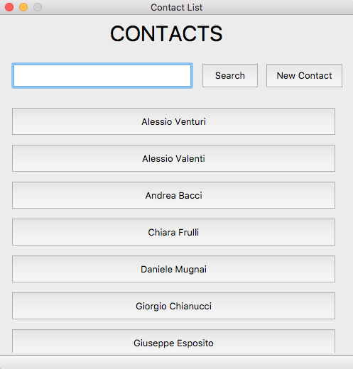
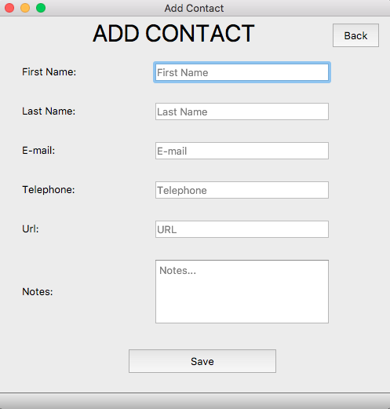
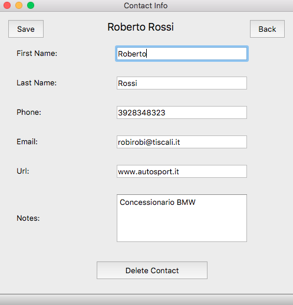

# contactManager

### Description
This project is a programming assignment done for Human Computer Interaction exam.
It consists in a Contact Manager application implemented in python.

### Dependencies
 * [PyQt 5.9.2]( https://pypi.org/project/PyQt5/5.9.2/)
 * [PyMongo 3.12.0](https://docs.mongodb.com/drivers/pymongo/)
 * [Python 3.7.4](https://www.python.org/downloads/release/python-374/)

### Screenshot

### Implementation
This application implement the MVC ( Model-View-Controller) pattern where the Model is :
 *  contact_model.py 

the Views are :
 * contactlist_view.py (1)
 * contactadd_view.py  (2)
 * contactinfo_view.py (3)
 
and the Controllers are :
 * contactlist_controller.py
 * contactadd_controller.py
 * contactinfo_controller.py

All interface are implemented with PyQt5 and converted in python through "pyuic" tool. In this way, I separate the view from the controller and editing the design of the view doesn't involve the editing of the controller.

To store the data I used MongoDB , a noSQL database. Docker is used to run MongoDB.

### Run the project
Before to run the project, you have to create a MongoDB container in Docker and run it.
Once created, in db.py you can change the parameters with yours to connect your docker, until I'll load the configuration files.

To run the project you have to enter in folder where you have download the project and run contactlist_controller.py  :
- `cd contactManager`
- `python contactlist_controller.py`

